# AMRIT Ecosystem Architecture

AMRIT (Accessible Medical Records via Integrated Technologies) is a highly modular platform composed of various UI applications, API microservices, and Mobile apps.

This document provides a high-level visual representation of how the different repositories and components in the AMRIT ecosystem interact with each other.

## System Overview

The system is generally split into:
1. **Client Layer**: Angular-based Web UIs and Kotlin-based Android Apps.
2. **API/Service Layer**: Spring Boot microservices that expose REST and FHIR endpoints.
3. **Data Layer**: Handled via `AMRIT-DB` for schema management and persistence.

## Architecture Diagram

```mermaid
graph TD
    %% Define Styles
    classDef ui fill:#e3f2fd,stroke:#1e88e5,stroke-width:2px,color:#0d47a1
    classDef api fill:#e8f5e9,stroke:#43a047,stroke-width:2px,color:#1b5e20
    classDef mobile fill:#fff3e0,stroke:#fb8c00,stroke-width:2px,color:#e65100
    classDef core fill:#f3e5f5,stroke:#8e24aa,stroke-width:2px,color:#4a148c
    classDef db fill:#eceff1,stroke:#607d8b,stroke-width:2px,color:#263238

    subgraph "Client Layer (Angular UIs)"
        UI_Common["Common-UI"]:::ui
        UI_Admin["ADMIN-UI"]:::ui
        UI_Inv["Inventory-UI / HWC-Inventory-UI"]:::ui
        UI_MMU["MMU-UI"]:::ui
        UI_TM["TM-UI"]:::ui
        UI_HWC["HWC-UI"]:::ui
        UI_Sched["Scheduler-UI / HWC-Scheduler-UI"]:::ui
        UI_ECD["ECD-UI"]:::ui
        UI_Help["Helpline1097-UI / Helpline104-UI"]:::ui
    end

    subgraph "Client Layer (Mobile Apps)"
        Mob_FLW["FLW-Mobile-App"]:::mobile
        Mob_HWC["HWC-Mobile-App"]:::mobile
    end

    subgraph "API / Service Layer (Spring Boot Microservices)"
        API_Common["Common-API"]:::api
        API_Admin["Admin-API"]:::api
        API_Inv["Inventory-API"]:::api
        API_MMU["MMU-API"]:::api
        API_TM["TM-API"]:::api
        API_HWC["HWC-API"]:::api
        API_Sched["Scheduler-API"]:::api
        API_ECD["ECD-API"]:::api
        API_Help["Helpline1097-API / Helpline104-API"]:::api
        API_FLW["FLW-API"]:::api
        
        API_Id["Identity-API / Identity-1097-API"]:::core
        API_Ben["BeneficiaryID-Generation-API"]:::core
        API_FHIR["FHIR-API"]:::core
    end

    subgraph "Data & Infra Layer"
        DB["AMRIT-DB (Flyway)"]:::db
    end

    %% Client to API Connections
    UI_Admin -->|Configures| API_Admin
    UI_Inv -->|Manages Stock| API_Inv
    UI_MMU -->|Drives| API_MMU
    UI_TM -->|Drives| API_TM
    UI_HWC -->|Drives| API_HWC
    UI_Sched -->|Schedules| API_Sched
    UI_ECD -->|Drives| API_ECD
    UI_Help -->|Drives| API_Help
    
    Mob_FLW -->|Syncs/Requests| API_FLW
    Mob_HWC -->|Manages| API_HWC

    %% Inter-service & Core Connections
    API_Common -.->|Used by all| API_Id
    API_Id -.->|Creates| API_Ben
    API_FHIR -.->|Standardizes| API_Id
    
    %% All APIs to DB
    API_Admin --> DB
    API_Inv --> DB
    API_MMU --> DB
    API_TM --> DB
    API_HWC --> DB
    API_Sched --> DB
    API_ECD --> DB
    API_Help --> DB
    API_FLW --> DB
    API_Id --> DB
    API_FHIR --> DB
    API_Ben --> DB

    %% Notes
    UI_Common -.->|Shared Components| UI_Admin
```

## Further Reading

- [AMRIT Developer Documentation](https://piramal-swasthya.gitbook.io/amrit)
- [Main README](../README.md) for a full list of all 12 UI repositories and 15 API repositories and their local ports.
